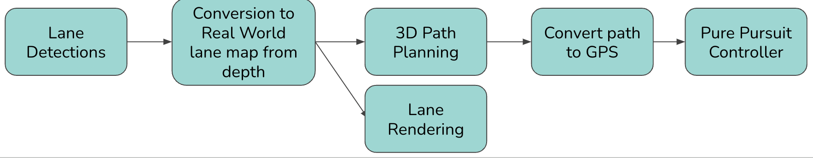
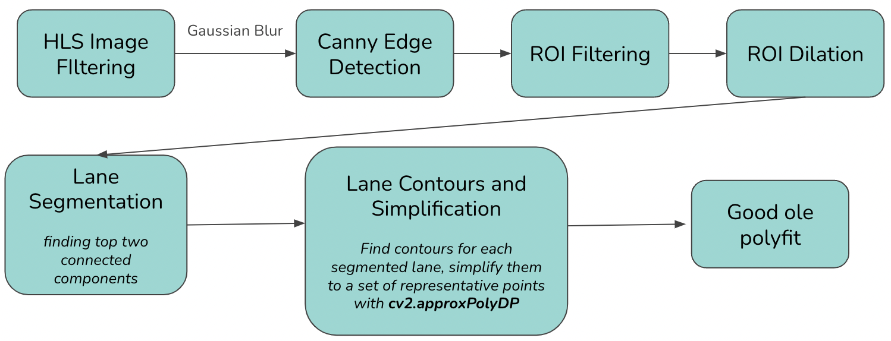
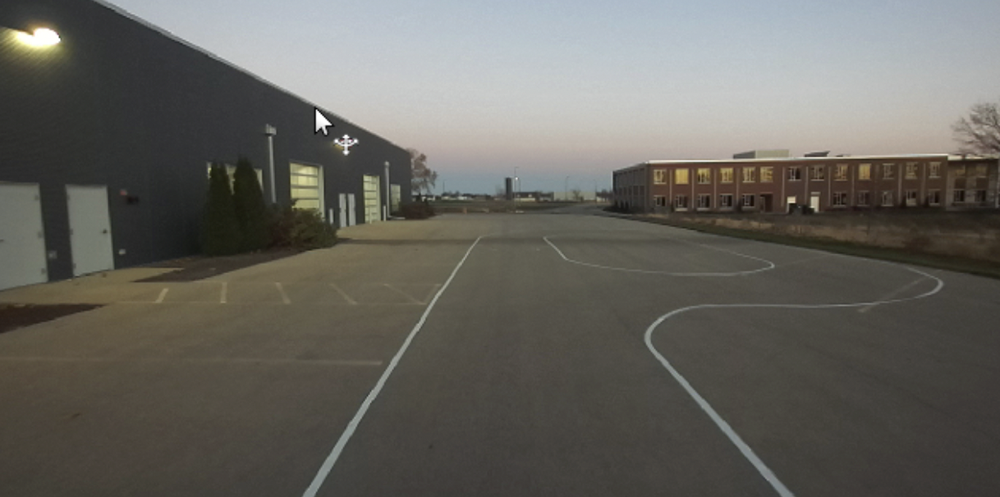
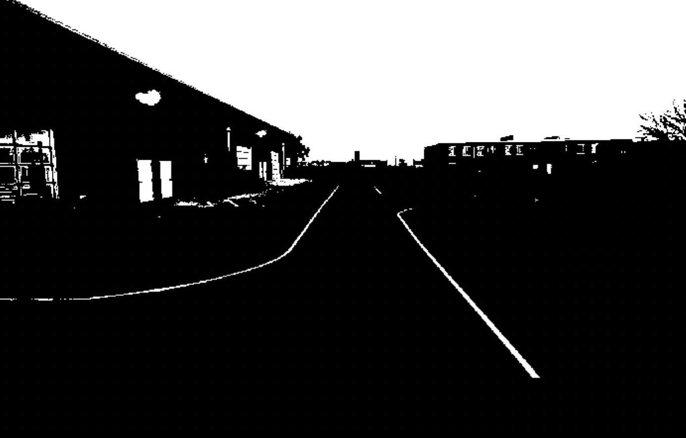
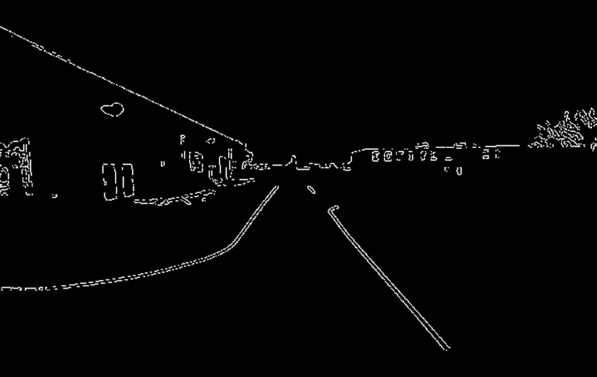
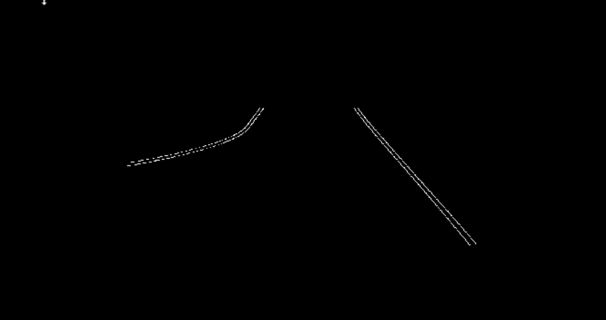
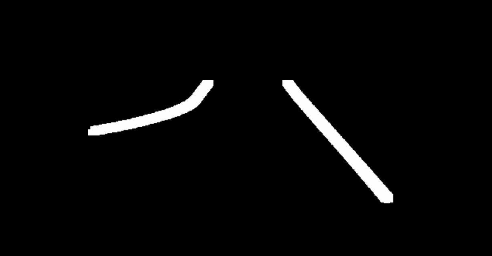
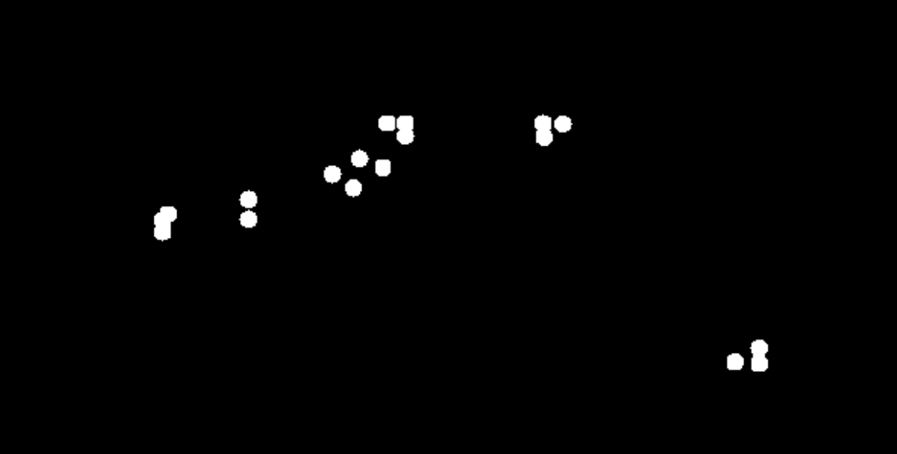
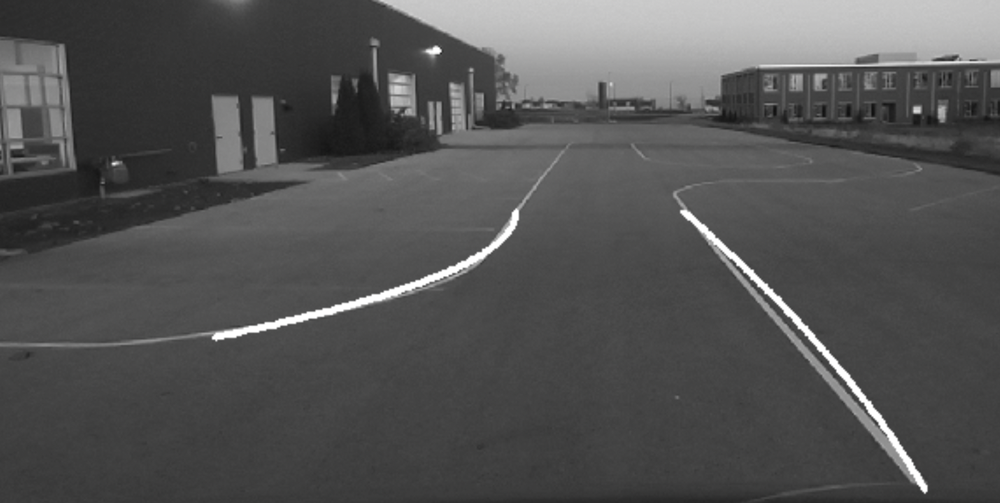
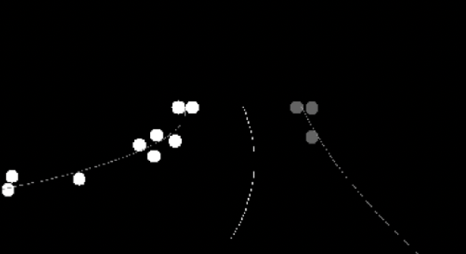

# Autonomous_Vehicle

#### [Project Video](https://drive.google.com/file/d/16VqdXCQg_ykUg4LMIUFqX3eGgADjnJ4y/view?usp=drive_link)

#### [Presentation Slides](https://docs.google.com/presentation/d/124aAc4pNV_MhHlzvXFsz7T2wNJRNb1p8YjODVC7ccMo/edit?usp=sharing)

## Intro & Motivation

The project goal is to improve the control system of the GEM vehicle so that it would be able to complete a full lap in the highbay facility while preserving safety.

## System Overall

Our goal is to use the ZED camera to detect lanes, using depth values to create a real world mapping of these lanes in relation to the car.  
Using real world coordinates, we can interface directly with the provided Pure-Pursuit GPS waypoint follower.

## Lane-Detection Method

## Path-Planning Method

- Get the polyfit of the detected lines (2 or less)
- Draw the curve(s) on the contour image
- Each curve interpolated by 100 points
- If there’re two curves
  - For every pair of points (one left, one right)
    - Get middle point
    - Append to middle-curve (path to go)
- If one curve
  - Predict waypoints based on previous waypoints’ polynomial parameters
- Generate Waypoints to Feed into Controller

## Waypoints

Once we have a set of waypoints in the pixel frame, we access each pixels corresponding depth value in meters, and use this to project the target lane into 3D space relative to the car. 

We then convert these coordinates to GPS via accessing the cars current GPS coordinates, and adding our delta X, delta Y, and delta Z for the waypoints.

Transform formulas:

- dX = Z / fx * (u - cx) 
- dY = Z / fy * (v - cy) 
- dZ = D

## Challenges in Process

- Filtering
  - Abandonment of the Particle Filter method
    - Solution: using HLS Image Filtering, Gaussian Blur, Canny Edge Detection
  - Noises (lighting)
    - Solution: new recording under good lighting, ROI dilation
  - Polyfit unstable
    - Real-time lane equations are detected, but they are not stable. Can be improved with polyfit averaging
- Path Planning
  - Missing lines
    - Solution: predicting waypoints via previous slope and polynomial parameters
- Coordinates conversion from Pixel to Read-world
  - Solution: Camera_info matrix projection from (u, v) to (X, Y, Z)
- Waypoints generation
  - Heading
    - Solution: sl::Pose (camera position gives orientation)
- Lane Rendering
  - Using marker library to add points to global map, which will allow us to interact with lanes as we’re driving

## Analysis of Results

- Waypoints in pixel frame
  - Used simplified contour to clean most noises
  - Relatively accurate
- Room for improvement
  - Recording in good lighting to reduce noise
- Further goal
  - Object detection if we have enough time
 
## Discussion of Novelty

- Lane Rendering is an active research topic, and opens the door to a ton of exciting possibilities
- Our detection solution is relatively lightweight, and we believe that after more tuning it can compete with much heavier neural network solutions

